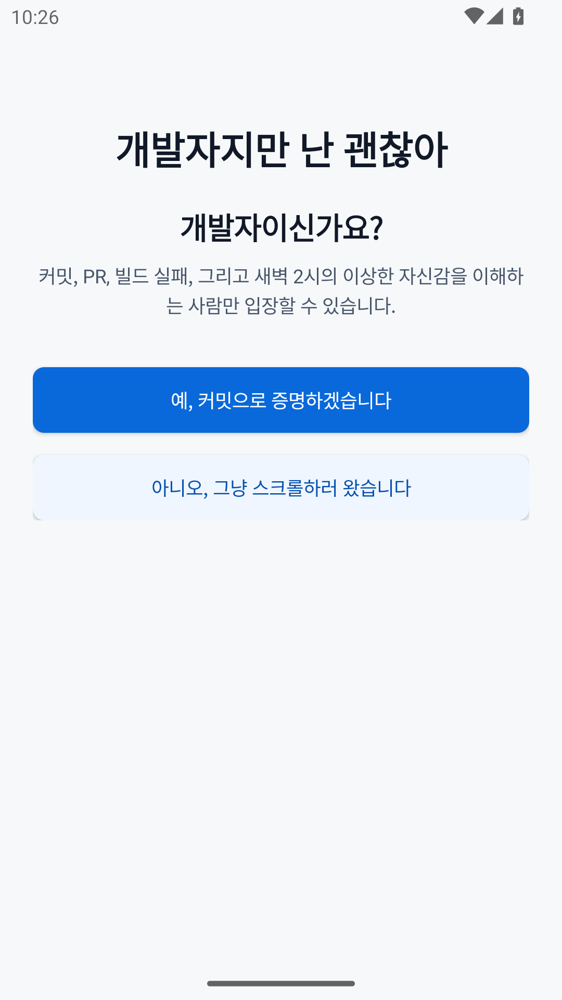
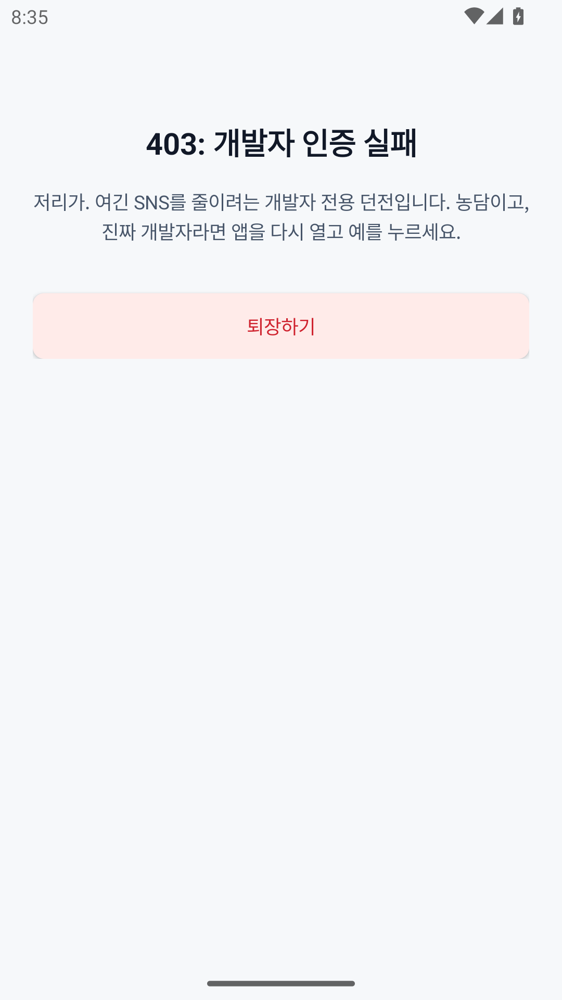
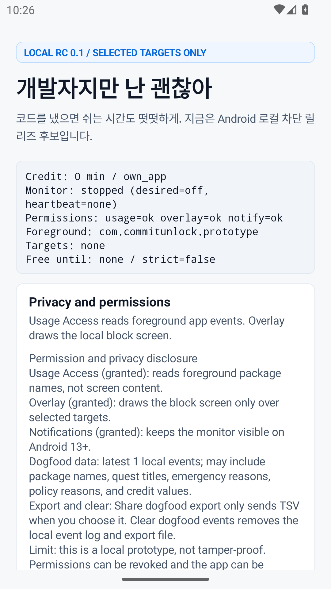
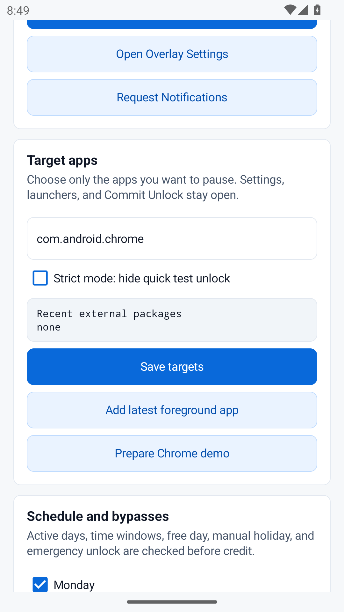
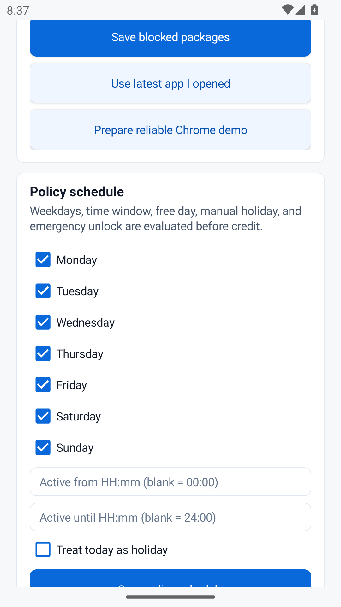
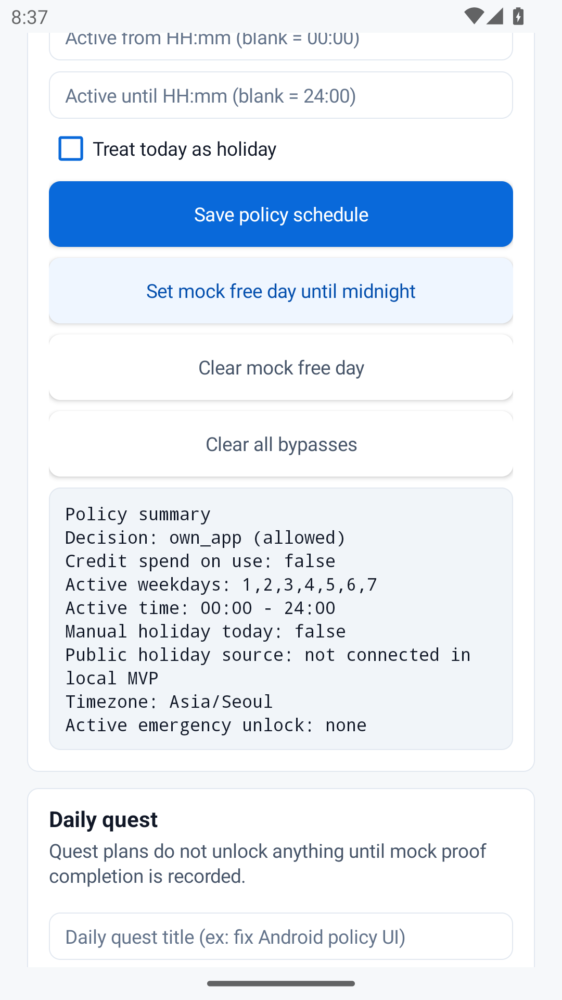
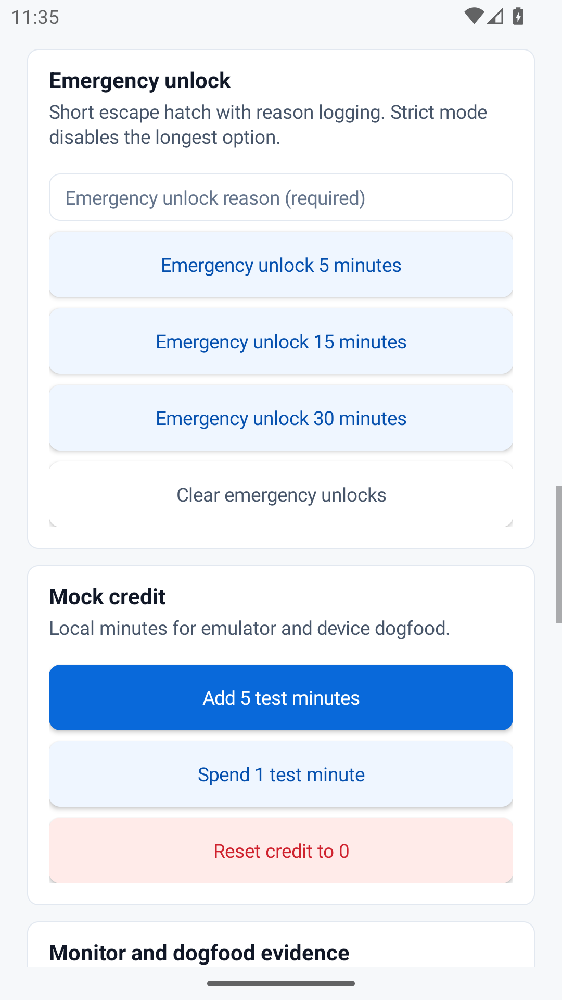
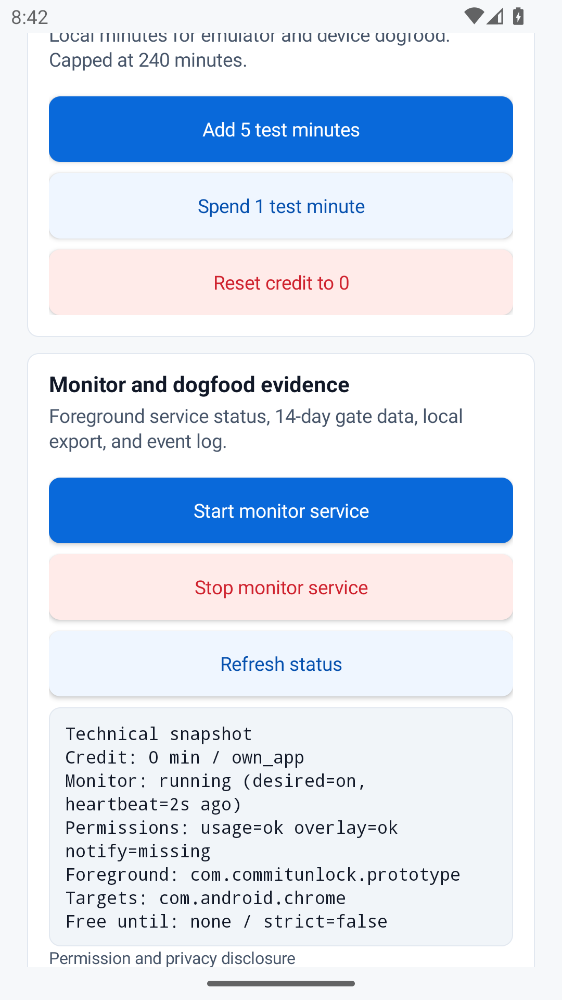
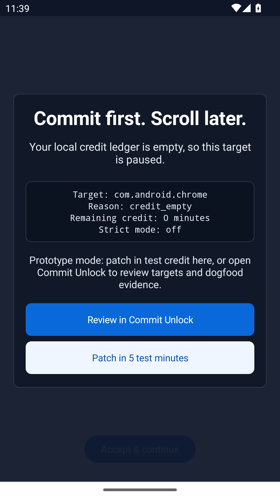

# Commit-to-Unlock

[](https://github.com/pigpgw/commit-to-unlock/actions/workflows/ci.yml)

개발자지만 난 괜찮아.

Commit-to-Unlock turns verified developer work into leisure credit for selected distracting apps. The current release candidate is intentionally local-first: Android can already block user-selected apps with mock credits, while GitHub scoring stays parked until real-device enforcement evidence is strong enough.

```text
코드를 냈으면, 쉬는 시간도 떳떳하게.
```

## Current Stage

`Android local blocker RC 0.1` is complete enough for local demo, emulator smoke, and private dogfood. It is not a public paid release.

The most important product decision is still this:

```text
Developer proof ledger first. Selected-app enforcement second.
```

That means the app should not become a generic screen-time blocker. The paid product later depends on proof history, GitHub/WakaTime/IDE evidence, credit ledger sync, browser or desktop enforcement, and explainable reward logic. The local Android blocker is the first technical gate, not the whole business.

## What Works Now

- Playful first-run developer gate.
- Local mock credit state with `remainingMinutes`, `blockedTargets`, `strictMode`, and `lastUpdatedAt`.
- Local mock credit is capped at `240` minutes so prototype shortcuts cannot create unrealistic balances.
- Manual package targets, with guardrails against blocking this app, launcher/settings/permission-controller, and core system services.
- Setup checklist that explains why blocking is not ready before the monitor starts.
- Reliable Chrome demo reset that clears bypasses, enables all days, sets `com.android.chrome`, and resets credit to `0`.
- `UsageStatsManager` foreground-app detection.
- Overlay block screen when a selected target is foreground and local credit is `0`.
- Access allowed when mock credit is above `0` or a policy exception applies.
- Automatic spend of `1` mock minute after `60` seconds of foreground use.
- Weekday, time-window, manual holiday, free-day, daily-quest, and emergency-unlock policy paths.
- Local dogfood event log, TSV export, analyzer, and in-app Gate A/B/C/D review.
- Optional redacted dogfood export for sharing evidence without target package names, quest titles, or emergency reasons.
- Runtime failure paths for settings, sharing, monitor startup, overlay, and export are logged instead of crashing the prototype.
- Android emulator evidence on Android 13, including block, unlock, and spend flow.

## Not Promised

These are deliberately outside RC 0.1:

- GitHub login, webhook ingestion, PR scoring, or commit scoring.
- Server sync, account system, payments, subscriptions, or money stake.
- iOS runtime enforcement before Xcode, device testing, and Family Controls entitlement work.
- AccessibilityService, Device Admin, uninstall prevention, or whole-phone lock.
- Parent, school, MDM, or child-safety mode.
- AI code-quality judgment or raw private diff storage.

The trust rule is simple: users choose what gets blocked, the app remains uninstallable, and account/settings/delete paths must never be trapped.

## Screenshots

Captured from the `CommitUnlockApi33` Android emulator on 2026-05-06. These are real app screens, not marketing mockups.

| Developer gate | Rejection branch |
| --- | --- |
|  |  |

| Home dashboard | Target selection |
| --- | --- |
|  |  |

| Policy schedule | Daily quest |
| --- | --- |
|  |  |

| Emergency and credit | Monitor evidence |
| --- | --- |
|  |  |

| Blocking overlay |
| --- |
|  |

## Quick Start

Prerequisites:

- Node.js 22+
- pnpm 10+
- JDK 17
- Android SDK 33
- Android platform-tools for `adb`

Clone and verify:

```bash
git clone https://github.com/pigpgw/commit-to-unlock.git
cd commit-to-unlock
pnpm install
pnpm test
pnpm build
pnpm typecheck
```

The Android Gradle Wrapper is committed, so global Gradle is not required.

```bash
./gradlew :apps:android:testDebugUnitTest
./gradlew :apps:android:assembleDebug
./gradlew :apps:android:lintDebug
```

## Run The Android Prototype

Use a physical Android device for product evidence. The emulator smoke is useful, but real-device data is the remaining MVP-A gate.

```bash
pnpm android:dogfood
```

Grant from the in-app permission section:

- Usage Access
- Display over other apps
- Notifications on Android 13+ if you want monitor status in the notification shade

Then run the shortest smoke:

1. Answer the developer gate with `예`.
2. Add `com.android.chrome` as a blocked target.
3. Save policy, reset credit to `0`, and start the monitor.
4. Open Chrome and confirm the overlay blocks it.
5. Add `5` test minutes and confirm Chrome is allowed.
6. Keep Chrome foreground for `60` seconds and confirm `1` minute is spent.
7. Export and analyze dogfood data:

   ```bash
   pnpm android:dogfood:export
   pnpm android:dogfood:analyze
   ```

Use `ANDROID_SERIAL=<device-id>` when more than one Android device is connected.

## Repository Map

```text
apps/
  android/  Native Kotlin local blocker prototype
  api/      Fastify health-only scaffold; GitHub runtime starts later
  ios/      SwiftUI + Screen Time API source skeleton
docs/       Product, security, design, competitive review, and execution plans
fixtures/   Cross-platform policy golden fixtures
packages/
  scoring/  Rules-first scoring package scaffold
  shared/   Shared TypeScript contracts and canonical policy logic
scripts/    Android dogfood install, export, and analyzer helpers
```

## Product Rules

The project only moves forward when these remain true:

- Block only user-selected targets.
- Never block this app, OS settings, permission screens, account deletion, or logout paths.
- Keep the app uninstallable.
- Treat strict mode as convenience friction, not tamper-proof control.
- Store local dogfood data locally until the user exports it.
- Do not store private repo raw diffs by default.
- Use AI only as an explainable helper after deterministic rules and ledger events exist.

## Documentation

Start here:

- [Documentation index](docs/README.md)
- [MVP execution plan](docs/mvp-execution-plan.md)
- [Android dogfood runbook](docs/android-dogfood-runbook.md)
- [Product and security hardening plan](docs/product-security-hardening-plan.md)
- [Competitive service review](docs/competitive-service-review.md)
- [App design](docs/app-design.md)

Platform-specific docs:

- [Android local blocker README](apps/android/README.md)
- [iOS local shield README](apps/ios/README.md)

## Roadmap Gates

| Gate | Decision |
| --- | --- |
| MVP-A | Finish physical-device Android smoke and 14-day dogfood evidence. |
| MVP-B | Build GitHub webhook security, dedupe, credit ledger, and mobile sync shape. |
| Product moat | Add proof history, browser/desktop companion, cross-device policy, and explainable ledger. |
| Paid release | Wait until blocker evidence and proof ledger value are both clear. |

Do not build payments, money stake, parent/school mode, leaderboard, full-diff LLM scoring, or broad account systems before the gate that actually needs them.

## Development Workflow

Work from `dev`, not `main`.

Use task-scoped branches:

```text
feature/<task-name>
fix/<task-name>
docs/<task-name>
chore/<task-name>
refactor/<task-name>
test/<task-name>
```

Keep commits split by task. For PRs with multiple task commits, preserve commits with a normal merge unless squash is explicitly requested.

Before merging implementation changes, run:

```bash
pnpm test
pnpm build
pnpm typecheck
./gradlew :apps:android:assembleDebug :apps:android:lintDebug
```
