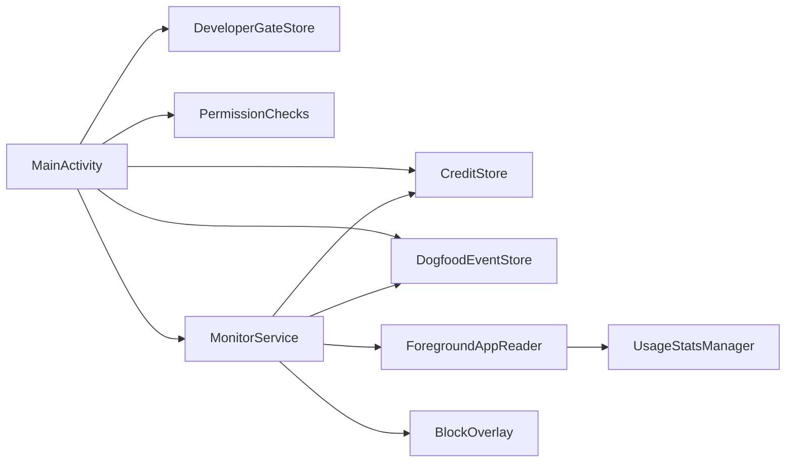
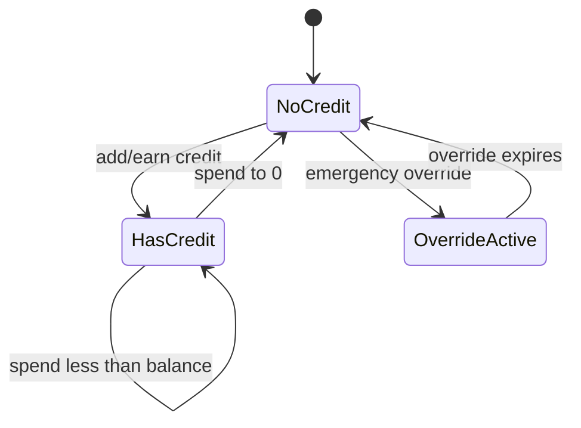
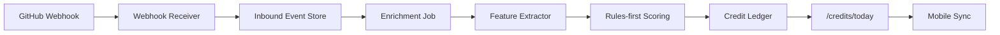

# Commit-to-Unlock App Design

문서 상태: v0.6
역할: 제품/기술 통합 설계 기준 문서
현재 최우선 구현: Android dogfood 데이터 수집과 Gate A/B/C 판단

현재 실행 순서는 [mvp-execution-plan.md](mvp-execution-plan.md)를 우선한다. 상세 결정 기록은 [decision-log.md](decision-log.md)를 따른다. 제품 전략/UX/사업 패키징은 [product-strategy-spec.md](product-strategy-spec.md)를 따른다. 디자인 조사와 화면 톤은 [design-research-and-ux-direction.md](design-research-and-ux-direction.md)를 따른다. 보안/로직 점검은 [security-and-logic-review.md](security-and-logic-review.md)를 따른다. GitHub runtime 진입 기준은 [github-sprint4-entry.md](github-sprint4-entry.md)를 따른다. 차단 범위와 계정/탈퇴 UX는 [control-account-design.md](control-account-design.md)를 따른다. proof/quest/요일/휴일/override 정책은 [proof-policy-mvp.md](proof-policy-mvp.md)를 따른다. 시장/니즈/피벗 기준은 [market-needs-and-pivot-plan.md](market-needs-and-pivot-plan.md)를 따른다. Android 다음 구현 단위는 [android-sprint-1.1-design.md](android-sprint-1.1-design.md)가 우선한다.

## 1. 결정 요약

Commit-to-Unlock은 “개발 활동을 했다고 직접 체크하면 앱을 열어주는 서비스”가 아니라, 검증 가능한 개발 이벤트를 크레딧 장부로 바꾸고 그 장부가 선택 앱 접근을 열고 닫는 제품이다.

수동 todo는 계획일 뿐 unlock 권한이 없다. 오늘 할 일을 등록할 수는 있지만, 완료 판정은 commit, PR, review, CI, mock proof 같은 proof-backed event가 있어야 한다.

시장 포지션은 generic screen-time blocker가 아니라 `developer proof ledger + optional blocking`이다. 차단 앱 자체는 무료/저가 경쟁이 강하고, 2026년에는 운동/걸음/학습 기반 earn-to-unlock 앱도 이미 보인다. 따라서 차별점은 “무언가를 하면 앱을 여는 것”이 아니라 “개발자의 검증 가능한 산출물을 설명 가능한 leisure credit으로 바꾸는 것”이다.

최적 결정은 다음과 같다.

- 첫 검증은 GitHub가 아니라 모바일 enforcement다. 앱이 실제로 선택 앱을 막지 못하면 scoring 품질은 제품 가치를 만들 수 없다.
- Android를 먼저 검증한다. 현재 repo는 Android SDK/JDK와 Gradle Wrapper로 빌드 가능하고, Xcode 앱은 아직 준비되지 않았다.
- Android B2C는 `UsageStatsManager + foreground service + overlay`로 간다. AccessibilityService, Device Admin, 앱 삭제 방지, 전체 기기 잠금은 MVP에서 제외한다.
- iOS는 FamilyControls/ManagedSettings 기반으로 간다. 선택 대상은 opaque token이므로 앱이 iOS에서 차단 앱 이름을 직접 표시한다는 UX를 약속하지 않는다.
- 모든 서비스가 아니라 사용자가 고른 target만 막는다. 앱 자기 자신, Settings, 계정/탈퇴/권한 화면은 차단 대상이 아니다.
- 앱은 삭제 가능해야 한다. 삭제 방지나 uninstall prevention을 제품 약속으로 삼지 않는다.
- Credit state는 로컬 mock contract를 유지하고, 서버 API는 나중에 같은 의미의 contract로 맞춘다.
- GitHub scoring은 PR 중심, rules-first, ledger-first로 재개한다. LLM은 판정자가 아니라 설명 보조층이다.

제품 약속 문구는 다음으로 고정한다.

> Verified dev work earns credits for selected distracting apps.

사용자-facing 카피는 처벌보다 회복/보상 언어를 쓴다.

- Ship code. Earn guilt-free screen time.
- Verified work becomes leisure credits.
- 코드를 냈으면, 쉬는 시간도 떳떳하게.
- 개발자지만 난 괜찮아.

금지 문구:

- “휴대폰 전체 잠금”
- “삭제 불가능”
- “AI가 알아서 폰을 통제”
- “코드 품질을 자동 평가”

브랜드 톤은 재미있고 개발자스럽게 간다. 단, 장난은 entry/onboarding/block copy에만 둔다. 권한, 데이터, 차단 정책, 보안 안내는 정확해야 한다.

허용 톤:

- `개발자이신가요?`
- `예, 커밋으로 증명하겠습니다`
- `403: 개발자 인증 실패`
- `저리가. 여긴 SNS를 줄이려는 개발자 전용 던전입니다.`

경계:

- 개발자 gate는 로컬 onboarding flag다. 실제 신원 인증, 보안 경계, 결제 권한으로 쓰지 않는다.
- 거절 화면은 재미로 앱을 종료할 수 있지만, 데이터를 삭제하거나 권한을 바꾸지 않는다.
- 오덕/개발자 밈은 써도 사용자를 모욕하거나 중독/ADHD를 조롱하지 않는다.

디자인 방향은 `developer utility dashboard + playful edge`로 고정한다. Opal, one sec, Freedom, Jomo 같은 앱은 차단/strict/schedule UX가 강하므로 참고하되, 이 제품은 generic wellness blocker처럼 보이면 안 된다. Home, Proof Feed, Ledger는 GitHub Primer/WakaTime에 가까운 dense developer tool로 설계하고, 재미있는 문구는 Developer Gate와 Block Overlay에만 제한한다.

기본 visual system:

| 요소 | 기준 |
| --- | --- |
| 배경 | light-first, `#F6F8FA` 계열 |
| surface | white panel, thin border |
| radius | 8dp 이하 |
| 상태 색 | success/warning/danger를 의미별로만 사용 |
| accent | GitHub blue 계열 |
| monospace | package, repo, reason code, PR ref |
| 피해야 할 테마 | neon hacker, one-note purple gradient, beige wellness |

## 2. Product UX

MVP의 사용자는 개인 개발자다. 학교/부모/MDM, 금전 스테이크, 리더보드, 부트캠프 관리자는 뒤로 미룬다.

핵심 화면은 여섯 개다.

| 화면 | 목적 | Sprint |
| --- | --- | --- |
| Developer Gate | “개발자 전용” 톤을 설정하고, 아니오 선택 시 장난스럽게 종료 | 1 |
| Home | 오늘 남은 크레딧, 정책 상태, 최근 credit event 표시 | 1 |
| Permissions | Usage Access, Overlay, Notification, Family Controls 상태 표시 | 1-2 |
| Targets | Android package 또는 iOS activity selection 관리 | 1-2 |
| Credit Test | mock credit 추가/소진/0 초기화 | 1 |
| Policy | 적용 요일, 수동 휴일, emergency unlock, free day 상태 | P1-P2 |
| Daily Quest | proof-backed 오늘의 개발 퀘스트 | P3 |
| Blocked/Shield | 차단 사유, 현재 credit 0, 앱으로 돌아가기 | 1-2 |

MVP 이후 상세 IA와 screen copy 규칙은 [product-strategy-spec.md](product-strategy-spec.md)의 `UX Information Architecture`와 `Screen Copy Rules`를 따른다. 특히 사용자는 raw score가 아니라 minutes, proof tier, reasons, risk flags를 본다.

Android prototype의 target selection은 수동 package 입력으로 시작한다. 프로덕션 Android에서는 `QUERY_ALL_PACKAGES` 없이 가야 하므로, 설치 앱 전체 스캐너를 만들지 않는다. 대신 Usage Access 승인 후 최근 foreground/usage package 목록을 보여주고 사용자가 그중 선택하게 한다. 수동 입력은 dev/debug 기능으로 남긴다.

iOS target selection은 FamilyActivityPicker만 사용한다. FamilyActivitySelection은 privacy-preserving opaque value이므로, 앱 내부 UI는 “선택한 앱 3개, 웹 도메인 2개”처럼 개수 중심으로 표현한다.

Strict mode의 의미는 “테스트/편의 override를 줄이는 정책 플래그”다. 삭제 방지나 tamper-proof를 뜻하지 않는다.

## 3. Mobile Enforcement Design

### Android

Android MVP는 다음 구조로 고정한다.



동작 규칙:

- Usage Access가 없으면 foreground app 감지를 시도하지 않고 권한 안내만 보여준다.
- Overlay 권한이 없으면 차단 화면을 띄우지 않고 권한 안내를 보여준다.
- MonitorService는 foreground service로 실행하고 상시 notification을 표시한다.
- `currentForegroundPackage`가 `blockedTargets`에 있고 `remainingMinutes <= 0`이면 overlay를 표시한다.
- `remainingMinutes > 0`이거나 target이 아니면 overlay를 숨긴다.
- 앱 자신의 package는 절대 차단하지 않는다.
- AccessibilityService는 쓰지 않는다.

Android 다음 보강 구현은 아래 네 가지다.

- UI에 현재 감지된 foreground package를 표시한다.
- dogfood event log를 단일 로컬 이벤트 저장소로 쓴다. 예: permission missing, foreground changed, target matched, overlay shown, overlay hidden, credit spent.
- strictMode가 true이면 overlay 안의 “테스트 credit 추가” 버튼을 숨긴다.
- 실기기 검증을 위해 `credit 0으로 초기화` 버튼을 추가한다.

Sprint 1.1의 상세 acceptance criteria는 [android-sprint-1.1-design.md](android-sprint-1.1-design.md)를 기준으로 한다.

### iOS

iOS MVP는 다음 target 구조로 고정한다.

```text
CommitUnlockPrototype
CommitUnlockDeviceActivityMonitor
CommitUnlockShieldConfiguration
CommitUnlockShieldAction
```

동작 규칙:

- main app은 Family Controls authorization을 요청한다.
- FamilyActivityPicker로 앱/카테고리/웹 도메인을 선택한다.
- 선택 token과 local credit state는 App Group container에 저장한다.
- `remainingMinutes <= 0`이면 ManagedSettings shield를 적용한다.
- `remainingMinutes > 0`이면 shield를 해제한다.
- DeviceActivity는 실제 사용량 기반 credit spend가 필요해질 때 추가한다.

iOS에서 앱 이름을 직접 알거나 raw browsing history를 보는 UX를 만들지 않는다. Apple Screen Time 계열 API의 privacy model에 맞춰 opaque selection을 그대로 다룬다.

## 4. Credit And Policy Design

로컬 contract는 Sprint 1-3의 canonical interface다.

```ts
export interface MobileCreditState {
  remainingMinutes: number;
  blockedTargets: string[];
  strictMode: boolean;
  lastUpdatedAt: string;
}
```

불변 조건:

- `remainingMinutes`는 0 이상의 정수 minute이다.
- `blockedTargets`는 platform-specific identifier다. Android는 package name, iOS는 serialized opaque selection/token reference다.
- `lastUpdatedAt`은 ISO 8601 UTC string이다.
- local store는 서버보다 우선하지 않는다. Sprint 5 이후 서버 sync가 들어오면 server state가 source of truth가 된다.

Credit state transition은 다음으로 고정한다.



Android prototype은 selected target이 foreground이고 기기가 interactive 상태일 때 60초마다 1분을 자동 차감한다. 이 spend engine은 local dogfood 검증용이며, 서버 sync 이후에는 ledger/policy engine이 source of truth가 된다. iOS spend는 DeviceActivity 기반 검증 전까지 구현하지 않는다.

차단 결정은 credit만 보지 않는다. policy engine은 요일, 시간, 수동 휴일, free day, emergency unlock을 credit보다 먼저 평가한다. 상세 우선순위와 데이터 모델은 [proof-policy-mvp.md](proof-policy-mvp.md)의 `Policy Resolution Order`를 따른다.

정책 reason code는 `packages/shared/src/policy.ts`의 `evaluatePolicyDecision` 결과를 기준으로 한다. Android overlay는 이 reason을 dogfood event log에 기록하고, 사용자-facing copy는 reason별로 안전하게 매핑한다.

## 5. Backend And Scoring Design

Sprint 4부터 서버를 다시 연결한다.



GitHub는 GitHub App + webhook-first 구조로 고정한다. webhook은 polling보다 지연과 quota 면에서 유리하고, PR files/commits/reviews/checks enrichment는 installation access token으로 수행한다.

Scoring v0 판단 순서:

1. eligibility: bot, duplicate delivery, unsupported event, selected repo 여부
2. enrichment: PR files, commits, reviews, review comments, checks/status, linked issue
3. feature extraction: file category, diff size, tests, CI, review, generated/vendor/lockfile risk
4. score decision: 0/10/25/45/60분 tier
5. ledger write: provisional, confirmed, clawback, override, manual_adjustment

저장 원칙:

- raw webhook payload은 dedupe/audit에 필요한 기간만 보관한다.
- private repo raw diff는 기본 저장하지 않는다.
- 장기 보관 대상은 feature vector, score decision, rationale, ledger entry다.
- LLM에 diff를 보낼 경우 최소 hunk와 metadata만 사용하고, 별도 opt-in 전에는 private repo full diff를 보내지 않는다.

Sprint 4 API 최소 shape:

| API | 역할 |
| --- | --- |
| `POST /webhooks/github` | GitHub delivery 수신, signature 검증, dedupe |
| `GET /credits/today` | 모바일이 사용할 현재 credit/policy state 반환 |
| `GET /activity/feed` | 최근 score decision과 ledger event 반환 |
| `GET/PUT /policy` | blocked target, strictMode, daily cap 저장 |
| `POST /override` | 긴급 해제 기록 |

`GET /credits/today`는 `MobileCreditState` 필드를 반드시 포함한다. 서버 메타데이터가 필요하면 `policyVersion`, `serverTime`, `source` 같은 optional field로 추가한다.

현재 `apps/api`는 `/health`만 제공한다. 이전 GitHub webhook placeholder는 실제 enrichment 없이 점수를 내므로 제거했다. Sprint 4에서 다시 추가할 때는 webhook dedupe, PR files/reviews/checks enrichment, score decision persistence, ledger write가 함께 들어가야 한다.

## 6. Roadmap

### Gate A: Android enforcement viability

목표: 모바일 차단 루프가 실제 Android 기기에서 제품 가치의 최소 조건을 만족하는지 확인한다.

통과 기준:

- Usage Access/Overlay 권한을 사용자가 직접 허용할 수 있다.
- foreground package 감지가 실제 대상 앱에서 동작한다.
- credit 0일 때 overlay가 2초 이내 표시된다.
- credit > 0일 때 overlay가 유지되지 않는다.
- 권한 회수나 서비스 중지 시 UI가 원인을 보여준다.

통과하지 못하면 GitHub scoring으로 넘어가지 않고 Android/iOS enforcement 대안을 먼저 재검토한다.

### Sprint 1.1: Android 실기기 검증 hardening

구현:

- foreground package 표시
- dogfood event log 표시
- credit 0 초기화 버튼
- strictMode overlay 동작
- README에 실기기 테스트 절차 추가

성공 기준:

- `./gradlew :apps:android:assembleDebug` 통과
- 실제 Android 기기에서 Usage Access/Overlay 권한 상태가 정확히 표시됨
- `com.android.chrome` 같은 target package가 foreground일 때 credit 0이면 overlay 표시
- credit > 0이면 overlay 숨김
- 앱 재시작 후 local credit state 유지

### Sprint 2: iOS Xcode 전환

구현:

- Xcode project 생성
- main app + 3개 extension target 생성
- App Group 설정
- Family Controls entitlement 준비
- FamilyActivityPicker selection 저장
- ManagedSettings shield apply/clear

성공 기준:

- 실제 기기에서 authorization 상태가 UI에 표시됨
- 선택 token 저장/복구 가능
- mock credit 0/5 전환에 따라 shield 적용/해제 가능

### Sprint 4: GitHub scoring 재개

구현:

- webhook dedupe
- GitHub App installation token
- PR files/reviews/checks enrichment
- score decision persistence
- credit ledger
- `/credits/today`

성공 기준:

- 실제 PR merge 후 1분 내 confirmed credit 생성
- 같은 delivery 재전송으로 중복 적립 없음
- generated-heavy/lockfile-only/bot PR은 0 또는 낮은 credit

착수 전 조건:

- 14일 dogfood에서 monitor enabled day가 8일 이상이다.
- 주당 blocked attempt가 4회 이상이다.
- 자연스러운 scorable dev event가 14일에 5개 이상이다.
- PR-only가 부족하면 commit batch 또는 WakaTime/IDE proof channel을 Sprint 4 범위에 포함한다.

## 7. Verification Checklist

Repo:

- `pnpm test`
- `pnpm build`
- `pnpm typecheck`
- `./gradlew :apps:android:assembleDebug`
- `./gradlew :apps:android:lintDebug`

Android device:

- `adb devices -l`에 실기기 표시
- debug APK install 성공
- Usage Access missing/granted 상태 전환 확인
- Overlay missing/granted 상태 전환 확인
- monitor start 후 foreground package 표시 확인
- blocked target + credit 0 overlay 확인
- blocked target + credit > 0 allow 확인
- strictMode true에서 test credit shortcut 제한 확인

iOS device:

- Xcode build 성공
- Family Controls authorization 성공/거부 UI 반영
- FamilyActivityPicker selection 저장
- ManagedSettings shield apply/clear 확인

## 8. 공식 근거

- Apple FamilyActivityPicker: https://developer.apple.com/documentation/familycontrols/familyactivitypicker
- Apple FamilyActivitySelection: https://developer.apple.com/documentation/familycontrols/familyactivityselection
- Android UsageStatsManager: https://developer.android.com/reference/android/app/usage/UsageStatsManager
- Google Play AccessibilityService API policy: https://support.google.com/googleplay/android-developer/answer/10964491
- GitHub webhooks: https://docs.github.com/en/webhooks/about-webhooks
- GitHub App rate limits: https://docs.github.com/en/apps/creating-github-apps/registering-a-github-app/rate-limits-for-github-apps
- GitHub pull request REST API: https://docs.github.com/en/rest/pulls/pulls
