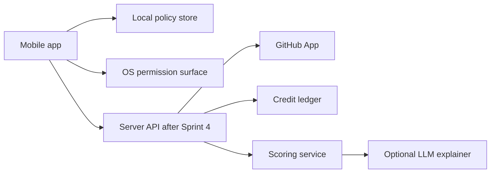

# Product And Security Hardening Plan

문서 상태: v0.2
작성일: 2026-05-04
역할: Commit-to-Unlock의 기획, 보안, 개인정보, 플랫폼 정책, 수익성 판단을 하나의 실행 gate로 묶는다.

## 1. Executive Decision

Commit-to-Unlock은 계속 개발한다. 단, 제품의 핵심은 `강한 차단 앱`이 아니라 `검증 가능한 개발 proof ledger + 사용자가 선택한 target enforcement`다.

최종 판단:

- Android local blocker는 MVP-A로 유지한다.
- GitHub proof/scoring은 MVP-B로 미룬다.
- 계정, sync, GitHub 연결이 들어가기 전까지 보안과 개인정보 gate를 먼저 통과해야 한다.
- 앱 삭제 방지, 전체 폰 잠금, 모든 서비스 차단, AccessibilityService 남용, Device Admin, money stake는 계속 금지한다.
- 수익화는 blocker 자체가 아니라 proof ledger, sync, history, multi-source proof, cross-device policy에 붙인다.

제품 문장:

```text
Verified developer work earns credits for selected distracting apps.
```

한국어 제품 문장:

```text
검증된 개발 활동을, 사용자가 고른 방해 앱의 leisure credit으로 바꿉니다.
```

이 제품이 지켜야 할 신뢰 약속:

1. 사용자가 고르지 않은 앱과 서비스는 막지 않는다.
2. 앱 자기 자신, OS 설정, 권한, 로그인, 로그아웃, 회원탈퇴, 데이터 삭제 화면은 막지 않는다.
3. 사용자는 앱을 삭제할 수 있다.
4. 삭제하지 않고 켜두기로 선택한 동안에는 사용자가 정한 target 정책을 일관되게 적용한다.
5. private repo raw diff는 기본 저장하지 않는다.
6. AI는 판정자가 아니라 설명 보조층이다.

## 2. Source Hierarchy

이 문서는 새 기능을 만들 때 가장 먼저 보는 hardening gate다.

| 순서 | 문서 | 역할 |
| --- | --- | --- |
| 1 | [mvp-execution-plan.md](mvp-execution-plan.md) | 지금 무엇을 만들지 결정 |
| 2 | [product-security-hardening-plan.md](product-security-hardening-plan.md) | 기획/보안/개인정보/플랫폼 정책 gate |
| 3 | [competitive-service-review.md](competitive-service-review.md) | 경쟁 서비스 조사와 paid moat |
| 4 | [android-dogfood-runbook.md](android-dogfood-runbook.md) | MVP-A 실기기 검증 절차 |
| 5 | [decision-log.md](decision-log.md) | 이미 확정한 결정 |
| 6 | [security-and-logic-review.md](security-and-logic-review.md) | 로직/보안 세부 점검 |
| 7 | [github-sprint4-entry.md](github-sprint4-entry.md) | GitHub runtime 진입 기준 |
| 8 | [control-account-design.md](control-account-design.md) | 선택 target, 삭제 가능성, 계정/탈퇴 UX |
| 9 | [app-design.md](app-design.md) | 제품/기술 통합 설계 |
| 10 | [proof-policy-mvp.md](proof-policy-mvp.md) | proof, quest, exception 정책 |

문서가 충돌하면 이 순서대로 따른다. 단, 플랫폼 공식 정책과 법적 요구가 이 문서보다 우선한다.

## 3. Non-Negotiable Invariants

### 3.1 Product Control

| Invariant | 이유 | 검증 방법 |
| --- | --- | --- |
| selected target만 차단 | 과잉 차단은 신뢰와 심사 리스크를 만든다 | target 저장 test, dogfood smoke |
| own app은 차단 금지 | 설정/권한/탈퇴 접근이 막히면 trapping UX가 된다 | policy test, Android smoke |
| Settings/permission/account/delete path 차단 금지 | 사용자는 언제든 통제권을 가져야 한다 | QA checklist |
| 앱 삭제 가능 | B2C self-control 제품에서 삭제 방지는 제품 약속이 아니다 | manifest/policy review |
| strict mode는 삭제 방지 의미가 아님 | strict mode를 tamper-proof로 오해하면 위험하다 | copy review |

### 3.2 Security And Privacy

| Invariant | 이유 | 검증 방법 |
| --- | --- | --- |
| raw diff 기본 저장 금지 | private repo code는 high sensitivity data다 | schema review, tests |
| mobile에 GitHub secret 저장 금지 | client compromise 시 전체 repo 접근 위험 | code review |
| webhook은 HMAC pass 전 parse/side effect 금지 | spoofing/replay 방지 | unit tests |
| delivery dedupe 없는 ledger write 금지 | 중복 credit은 trust를 깬다 | idempotency tests |
| wildcard CORS 금지 | API surface 확장 시 browser abuse 방지 | config tests |
| 계정 생성 시 계정 삭제 path 필수 | Apple/Google 정책과 사용자 신뢰 | UX checklist |

### 3.3 Product Scope

| 금지 범위 | 재검토 조건 |
| --- | --- |
| AccessibilityService | Google Play 정책 검토와 접근성 목적이 명확할 때만 |
| Device Admin/Device Owner | B2B/managed device 별도 제품일 때만 |
| 부모/학교/미성년자 모드 | COPPA/FERPA/GDPR/KR 개인정보 동의 설계 후 |
| money stake/벌금 | 결제, 환불, 차지백, 미성년자, 스토어 정책 검토 후 |
| leaderboard | self-regulation 제품성과 privacy risk 재검토 후 |
| full-diff LLM scoring | opt-in, retention, redaction, private repo policy 후 |

## 4. Product Risk Model

이 제품의 실패 리스크는 세 가지다.

| 리스크 | 신호 | 대응 |
| --- | --- | --- |
| 차단 앱으로만 인식됨 | 사용자가 Opal/Freedom/ScreenZen과 가격 비교 | proof ledger, GitHub/WakaTime history를 전면에 둔다 |
| 모바일 enforcement가 약함 | overlay 지연, 권한 회수, 제조사 제한 | desktop/browser blocker fallback을 준비 |
| proof 공급이 부족함 | 14일 동안 merged PR이 적음 | commit batch, WakaTime/IDE proof를 capped fallback으로 추가 |
| Android-only paid product가 됨 | ScreenZen/free blocker와 비교됨 | paid moat는 cross-device, browser/desktop, proof history로 제한 |

수익성 판단:

- Free/local blocker는 acquisition과 dogfood용이다.
- 구독 명분은 ongoing proof processing, scoring history, sync, cross-device policy, desktop/browser integration이다.
- Local Plus one-time은 구독 거부층 대응책이다.
- Cohort는 가능하지만 leaderboard와 처벌형 report는 제외한다.

가격 가설:

| Plan | 가격 가설 | 팔 수 있는 이유 |
| --- | ---: | --- |
| Free Local | $0 | selected target local blocker, dogfood, mock credit |
| Local Plus | $29-49 one-time | advanced local policy, export, offline utility |
| Pro | $4.99-6.99/month | GitHub/WakaTime proof ledger, sync, explanations |
| Student | $19-29/year | low-cost proof habit system |
| Cohort | $2-4/seat/month | override/ledger rhythm report, no leaderboard |

Gate E 전에는 결제 UI를 만들지 않는다.

## 5. Threat Model

### 5.1 Actors

| Actor | 목표 | 대응 |
| --- | --- | --- |
| Self-bypassing user | 앱 삭제, 권한 회수, mock credit, 시간 변경 | tamper-proof가 아니라 기록/설명/UX 개선 |
| External attacker | webhook spoofing, replay, token theft | HMAC, dedupe, secret store, least privilege |
| Curious user | private repo data가 어디까지 저장되는지 확인 | retention/export/delete UI |
| Malicious repo contributor | fake PR, bot review, duplicate patch | abuse rules, idempotent ledger, clawback |
| Platform reviewer | 과도한 권한/차단 문구 검토 | prominent disclosure, selected target only, no uninstall prevention |

### 5.2 Trust Boundaries



Boundary rules:

- Local store is trusted only for local prototype behavior.
- Server ledger becomes source of truth after sync.
- GitHub App secrets stay server-side.
- LLM receives structured features first, not raw private code.
- OS permission status is an input, never a thing to bypass.

## 6. Data Classification And Retention

| 데이터 | 예 | 민감도 | 저장 기준 |
| --- | --- | --- | --- |
| Local policy | blocked package, schedule, strictMode | medium | local-only, clear/export 가능 |
| Dogfood log | target package, reason, quest title | medium | 최근 1,000개, user-initiated export |
| Account profile | email, user id, timezone | medium | server sync 계정에만 |
| GitHub metadata | repo, PR number, author, timestamps | medium/high | 최소 저장, revoke/delete 가능 |
| Feature vector | file category counts, review counts, CI flags | medium | scoring audit용 보관 |
| Raw webhook payload | GitHub event JSON | high for private repos | short retention only, production은 encrypted short retention |
| Raw diff/file content | patch hunk, file content | high | 기본 장기 저장 금지 |
| OAuth/GitHub secret | private key, webhook secret, installation token | critical | server secret store only |
| LLM prompt/output | diff summary, rationale | high if private repo | private repo opt-in 전 금지 |

Retention defaults:

| 항목 | 기본값 | 예외 |
| --- | --- | --- |
| local dogfood event | max 1,000 events | user clear |
| raw webhook payload | production default off or short debug window | incident/debug policy 필요 |
| normalized proof metadata | account lifetime | account/delete GitHub data request |
| score decision | account lifetime | account/delete GitHub data request |
| server credit ledger | account lifetime | export before deletion option |
| deleted account tokens | immediate revoke/delete | 법적 보존 필요 시 별도 고지 |

## 7. Platform Hardening

### 7.1 Android B2C

Allowed:

- Usage Access로 foreground package 감지.
- foreground service와 persistent notification.
- overlay로 selected target 위에 blocking screen 표시.
- manual package input과 recent foreground package 선택.

Forbidden:

- `QUERY_ALL_PACKAGES`.
- AccessibilityService 기반 자동 조작.
- Device Admin/Device Owner.
- uninstall prevention.
- 전체 폰 잠금.
- 사용자가 선택하지 않은 target 자동 추가.

P0 implementation checks:

- target 저장 시 own package 제거.
- 빈 값, 중복, 공백 package 제거.
- system-critical package denylist를 production 전에 추가.
- permission missing이면 monitor/spend/overlay를 중단하고 이유를 보여준다.
- privacy disclosure는 setup 중 자연 흐름에 노출한다.

### 7.2 iOS B2C

Allowed:

- FamilyControls authorization.
- FamilyActivityPicker로 user-selected apps/domains 선택.
- ManagedSettings shield apply/release.
- opaque token summary 중심 UI.

Forbidden:

- 전체 기기 잠금 약속.
- selected token을 사람이 읽을 수 있는 앱명으로 표시하겠다는 약속.
- entitlement 없이 배포 가능하다는 일정 약속.
- supervised/MDM 기능을 개인용 앱과 섞는 것.

P0 implementation checks:

- authorization denied/granted 상태 UI.
- shield state는 local/server credit state와 동기화.
- App Group 저장 값은 selection reference, credit cache, policy version으로 제한.
- ShieldAction extension은 직접 emergency unlock을 만들지 않는다.

## 8. Account And Privacy Hardening

Local MVP는 계정이 없다. 계정은 GitHub proof ledger 또는 sync가 필요해지는 순간에만 요청한다.

권장 auth:

- email magic link 또는 passkey 우선.
- GitHub는 로그인 수단이 아니라 proof source 연결로 취급.
- GitHub 연결 해제와 계정 삭제는 분리.

필수 UX:

| 기능 | 조건 |
| --- | --- |
| Sign up | 서버로 올라가는 데이터와 삭제 정책을 먼저 설명 |
| Login | 실패해도 local controls, 설정, 삭제 안내 접근 가능 |
| Logout | sync cache clear와 local blocking 유지/중단 선택 제공 |
| Delete account | 앱 안에서 찾기 쉽고, 웹 deletion path도 제공 |
| Disconnect GitHub | GitHub enrichment 중단과 GitHub-derived data 삭제 옵션 제공 |
| Export data | ledger/proof/account data export path 제공 |

Delete account must remove:

- account profile
- GitHub installation mapping
- repo allowlist
- proof events
- feature vectors
- score decisions
- server credit ledger, unless user explicitly exports/keeps local history
- mobile sync tokens

삭제 보류 기간이 있다면 최종 삭제 예정일을 보여준다. `비활성화`만 제공하는 것은 금지한다.

## 9. GitHub Proof Security

Sprint 4는 아래 순서만 허용한다.

```text
webhook security -> delivery dedupe -> PR enrichment -> feature vector -> score decision -> credit ledger -> mobile sync
```

Webhook receiver requirements:

1. raw body를 보존한다.
2. `X-Hub-Signature-256`가 없으면 401.
3. HMAC-SHA256과 timing-safe compare를 사용한다.
4. signature pass 전에는 payload를 parse하지 않는다.
5. `X-GitHub-Delivery`를 provider delivery id로 unique 저장한다.
6. duplicate delivery는 202로 끝내고 ledger side effect를 만들지 않는다.
7. event allowlist만 처리한다.
8. enrichment 없는 score decision은 만들지 않는다.

GitHub App permission defaults:

| Permission | 기본 |
| --- | --- |
| Metadata | required read |
| Pull requests | required read |
| Checks | required read |
| Commit statuses | optional read |
| Contents | avoid by default |
| Issues | defer |

Scoring storage rule:

- PR files endpoint의 path/status/additions/deletions/changes는 normalized feature로 저장 가능.
- patch hunk, raw diff, file content, review body text는 기본 장기 저장 금지.
- private repo LLM explanation은 opt-in 전 off.

## 10. Scoring And AI Hardening

AI 스코어링의 목적은 코드 품질 심사가 아니다. 목적은 leisure credit에 충분한 실질 개발 활동인지 설명 가능하게 판단하는 것이다.

Scoring policy:

| 영역 | 기준 |
| --- | --- |
| eligibility | selected repo, non-bot, supported event, deduped subject |
| features | file category, size, tests, CI, review, lifecycle, generated ratio |
| decision | 0/10/25/45/60 minute tier |
| explanation | reasons, risk flags, confidence |
| ledger | append-only positive/negative rows |

Abuse flags:

- whitespace-only
- rename-only
- lockfile-only
- generated/vendor-heavy
- duplicate patch hash
- bot/self-review
- stale CI
- fast revert
- unusual burst
- patch missing

LLM rules:

- structured JSON output only.
- no autonomous action.
- no raw private diff by default.
- no score hidden from rules engine.
- user-facing copy shows minutes and reasons, not raw score.

## 11. Design Hardening

브랜드는 재미있어도 제품은 신뢰를 잃으면 끝난다.

Fun allowed:

- Developer Gate
- empty state
- block overlay의 짧은 copy
- proof earned celebration

Fun forbidden:

- permission disclosure
- privacy policy
- delete account
- GitHub repo access
- payment or refund
- data export/delete

UI principles:

- Home은 ledger/status 중심.
- Target selection은 실수 방지가 우선.
- 차단 대상과 차단 제외 대상을 분리해서 보여준다.
- dangerous action은 `Disconnect GitHub`, `Clear local data`, `Delete account`로 명확히 분리한다.
- no card-in-card.
- reason code, package, repo, PR ref는 monospace.
- account/privacy/delete copy는 장난 없이 정확하게 쓴다.

## 12. Gate Matrix

| Gate | 목적 | 통과 기준 | 실패 대응 |
| --- | --- | --- | --- |
| A: Enforcement | Android/iOS selected target 차단이 실제로 되는지 | real-device smoke pass, overlay 2초 이내, 권한 상태 정확 | desktop/browser fallback 검토 |
| B: Dogfood Need | 본인이 계속 켜둘 가치가 있는지 | 14일 중 8일 monitor, 주 4회 blocked attempt, override 주 3회 이하 | blocker 강도보다 UX/target/pivot 조정 |
| C: Proof Supply | 개발 proof가 충분한지 | 14일 scorable event 5개 이상 | WakaTime/IDE/commit batch 추가 |
| D: Trust/Privacy | sync 전 신뢰 조건 | permission/privacy UI, retention/delete/revoke, HMAC/dedupe | GitHub sync 금지 |
| E: Monetization | 돈 받을 명분 | ledger가 blocker 없이 가치 있음 | payment 금지, local utility로 축소 |

Gate D는 Sprint 4의 hard blocker다. HMAC, dedupe, retention, revoke/delete 없이 GitHub sync나 credit ledger API를 열지 않는다.

## 13. Test And Review Requirements

### P0 Before More Product Surface

- Android target guard tests: own package, empty target, duplicate target.
- Android smoke: Usage Access missing/granted, Overlay missing/granted, selected target credit 0, selected target credit > 0.
- Data Quality smoke: dogfood event includes foreground, target match, overlay shown/hidden, credit spent.
- Copy review: no whole-phone lock, no uninstall prevention, no all-services block.

### P0 Before Sprint 4 Runtime

- GitHub webhook official sample signature test.
- mutated payload signature failure test.
- duplicate delivery no side-effect test.
- event allowlist test.
- CORS closed-by-default test.
- raw diff storage off-by-default test.
- delete/revoke/export API design review.

### P1 Before Private Beta

- account deletion happy path and failure path.
- GitHub disconnect and delete GitHub-derived data.
- ledger idempotency and clawback tests.
- package/repo data export.
- privacy policy draft and store disclosure draft.

### P2 Before Paid Release

- threat model review update.
- dependency audit.
- secret rotation procedure.
- incident response note.
- support playbook for false positives and deletion requests.

## 14. Immediate Implementation Queue

완료된 immediate queue:

1. `docs/product-security-hardening-plan`
   이 문서와 source-of-truth 링크를 반영한다.

2. `feature/android-target-guardrails`
   own package 제거, empty/duplicate normalization, dangerous/system target denylist draft, unit tests.

3. `fix/android-monitor-runtime-state`
   desired monitor state와 heartbeat-backed runtime state를 분리해 stale service 표시를 막는다.

4. `docs/phase-one-closeout`
   1차 구현을 code/test/docs closeout으로 닫고, 제품성 증거는 실기기 dogfood gate로 분리한다.

남은 작업 순서는 이렇다.

1. `docs/real-device-dogfood-evidence`
   실제 기기 runbook 결과를 문서화하고 Gate A/D evidence를 남긴다.

2. `docs/browser-companion-spike`
   [competitive-service-review.md](competitive-service-review.md)의 Freedom, Cold Turkey, FocusMe 교훈을 바탕으로 proof ledger와 desktop/browser enforcement를 연결하는 설계를 작성한다.

3. `feature/github-webhook-security`
   HMAC verification, delivery dedupe, inbound event store, tests. Ledger write는 아직 하지 않는다.

4. `docs/wakatime-ide-proof-spike`
   GitHub PR-only 공급이 약할 때 capped provisional credit fallback을 설계한다.

5. `feature/account-lifecycle-contract`
   signup/login/logout/delete/export/revoke API contract와 UI skeleton. GitHub sync 전 deletion path를 먼저 고정한다.

이 순서가 중요한 이유는 간단하다. 사용자가 신뢰할 수 없는 차단 앱은 오래 켜두지 않고, 개인정보를 설명하지 못하는 GitHub 연동은 설치되지 않는다.

## 15. Sources Checked

2026-05-04 기준으로 아래 공식 자료를 확인했다.

- Apple: [Offering account deletion in your app](https://developer.apple.com/support/offering-account-deletion-in-your-app/)
- Apple: [App Review Guidelines](https://developer.apple.com/app-store/review/guidelines/)
- Apple: [App Privacy Details](https://developer.apple.com/app-store/app-privacy-details/)
- Apple: [FamilyControls](https://developer.apple.com/documentation/familycontrols)
- Apple: [ManagedSettings shield](https://developer.apple.com/documentation/managedsettings/managedsettingsstore/shield)
- Google Play: [User Data policy](https://support.google.com/googleplay/android-developer/answer/10144311)
- Google Play: [Account deletion requirements](https://support.google.com/googleplay/android-developer/answer/13327111)
- Google Play: [Developer Program Policy](https://support.google.com/googleplay/android-developer/answer/16528695)
- GitHub: [Validating webhook deliveries](https://docs.github.com/en/webhooks/using-webhooks/validating-webhook-deliveries)
- OWASP: [MASVS](https://mas.owasp.org/MASVS/)
- OWASP: [API Security Top 10 2023](https://owasp.org/API-Security/editions/2023/en/0x10-api-security-risks/)
