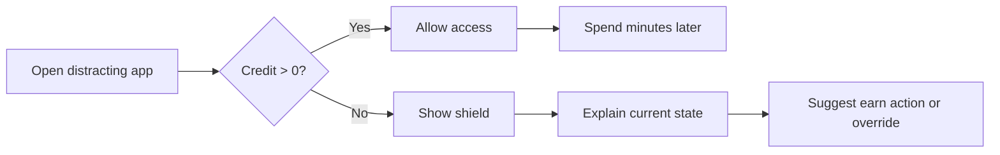
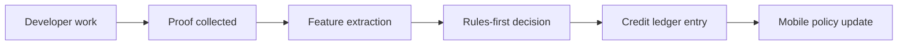
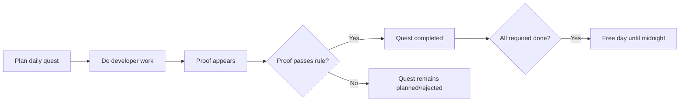
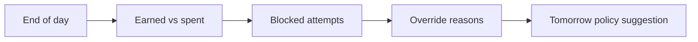

# Commit-to-Unlock Product Strategy Spec

문서 상태: v0.2
역할: 기획, UX, 사업 모델, 개발 우선순위를 하나의 실행 기준으로 묶는다.  
전제: 인터뷰/설문/fake-door 없이 build-first로 간다. 단, 제품이 약하면 빠르게 축소하거나 피벗한다.

## 1. Product Thesis

Commit-to-Unlock은 차단 앱이 아니다. 개발자가 실제로 만든 작업 증거를 `leisure credit`으로 바꾸는 self-regulation product다.

핵심 가설:

> 개발자는 자기신고형 todo보다 검증 가능한 개발 활동을 더 신뢰하고, 그 활동이 방해 앱 접근권으로 변환될 때 반복 사용 동기가 생긴다.

성공하려면 세 가지가 동시에 맞아야 한다.

1. 사용자가 실제로 막고 싶은 앱/웹사이트가 있어야 한다.
2. 모바일 또는 desktop enforcement가 충분히 불편한 우회 비용을 만들어야 한다.
3. 개발 활동이 credit으로 바뀌는 과정이 납득 가능해야 한다.

하나라도 실패하면 제품은 generic blocker 또는 재미있는 데모에 머문다.

## 2. Positioning

### Primary Position

> Verified developer proof-of-work becomes guilt-free screen time.

사용자에게는 “코딩 안 하면 막는다”가 아니라 “검증된 개발 활동을 했으니 떳떳하게 쉬게 해준다”로 말한다.

### Do Not Compete As

| 피해야 할 포지션 | 이유 |
| --- | --- |
| 일반 스크린타임 차단 앱 | Opal, Freedom, Jomo, ScreenZen, Roots 등 기존 강자가 많고 무료/저가 대안이 강하다. |
| AI 코드 품질 평가기 | 개발자는 black-box AI 평가를 불신할 수 있고, 제품 목적도 코드 리뷰가 아니다. |
| 부모/학교 통제 앱 | 규제, 동의, MDM, 스토어 심사 리스크가 MVP 검증을 흐린다. |
| 벌금/예치금 앱 | 결제/환불/분쟁/미성년자 리스크가 크고 초기 신뢰를 해친다. |

### Compete As

| 경쟁 축 | Commit-to-Unlock의 차별점 |
| --- | --- |
| generic blocker | 차단 조건이 시간표가 아니라 검증된 개발 활동이다. |
| earn-to-unlock app | 보상 근거가 걸음/운동/퀴즈가 아니라 개발자의 실제 산출물이다. |
| WakaTime/RescueTime | 측정에서 끝나지 않고 credit ledger와 enforcement로 이어진다. |
| Beeminder류 | 금전 벌금보다 낮은 법무 리스크로 accountability를 만든다. |

## 3. Target Users

### ICP 1: Self-Control Developer

Job-to-be-done:

> 코딩을 해야 하는데 YouTube, Reddit, X, Discord, 게임을 계속 열게 된다. 억지로 막히는 것보다, 오늘 실제로 개발한 만큼만 쉬고 싶다.

특징:

- GitHub, IDE, 터미널을 매일 쓴다.
- 일반 blocker를 써봤거나 쉽게 우회했다.
- 자기신고형 checklist를 믿지 않는다.
- repo 권한과 데이터 저장 범위를 따져본다.

Must-win moment:

- 방해 앱을 열었는데 credit이 0이라 막힌다.
- block screen이 “왜 막혔는지”와 “무엇을 하면 열리는지”를 정확히 알려준다.
- 실제 작업 후 credit이 생기고, 사용자는 그것을 억울하지 않다고 느낀다.

### ICP 2: Coding Student / Portfolio Builder

Job-to-be-done:

> 취업/부트캠프/사이드프로젝트를 꾸준히 해야 하는데, 결과물이 쌓이는 리듬을 만들고 싶다.

특징:

- 매일 merged PR이 나오지는 않는다.
- commit batch, issue, WakaTime/IDE activity 같은 낮은 신뢰도 proof도 필요하다.
- 가격 민감도가 높다.

설계 영향:

- PR-only는 activation을 떨어뜨릴 수 있다.
- student plan과 capped provisional credit이 필요하다.

### ICP 3: Focus-App Power User

Job-to-be-done:

> 기존 차단 앱은 너무 쉽게 우회하거나, 너무 비싸거나, 왜 열고 닫히는지 납득이 안 된다.

특징:

- hard mode, strict mode, physical friction 같은 개념을 이미 안다.
- blocker subscription에 가격 저항이 있다.
- 개발자라면 proof ledger 포지션을 빠르게 이해한다.

## 4. Product Principles

| 원칙 | 구현 의미 |
| --- | --- |
| Explain before restrict | 막을 때는 항상 이유와 다음 unlock 조건을 보여준다. |
| Ledger over score | 사용자는 점수가 아니라 minutes, source, reason을 본다. |
| Proof over self-report | 자기 체크는 MVP에서 제외한다. |
| Local-first enforcement | Sprint 1-3은 서버/GitHub 없이도 차단 루프가 돈다. |
| Privacy by default | private repo raw diff는 기본 저장하지 않는다. |
| No shame copy | 중독/실패/벌점보다 회복/리듬/떳떳한 휴식을 말한다. |
| Policy-compliant control | 전체 폰 잠금, 삭제 방지, 우회적인 Accessibility 사용은 피한다. |
| Proof-backed quests | 오늘 할 일은 등록할 수 있지만, unlock은 개발 증거가 있어야 한다. |

## 5. Core Product Loops

### Loop A: Block Loop

성공 기준:

- block screen이 짜증만 만드는 화면이 아니라 다음 행동을 만드는 화면이어야 한다.
- credit 0 상태에서 사용자가 앱을 끄고 개발 행동으로 돌아가는 비율을 본다.

### Loop B: Earn Loop

성공 기준:

- 사용자는 “왜 10분/25분/45분인지” 이해한다.
- scoring을 조작하려는 행동보다 실제 작업을 하는 편이 더 쉽다.

### Loop B2: Quest Loop

성공 기준:

- todo click만으로 해제되지 않는다.
- 모든 required quest가 proof-backed completed일 때만 free day가 된다.
- free day는 기록되고 다음 회고에 표시된다.

### Loop C: Reflection Loop

성공 기준:

- 사용자는 streak 압박보다 “이번 주 개발 리듬”을 본다.
- Weekly rhythm이 proof ledger의 과금 명분이 된다.

## 6. UX Information Architecture

### Prototype IA

| 화면 | 목적 | 포함 정보 |
| --- | --- | --- |
| Home | 현재 상태 확인 | remainingMinutes, monitor state, strictMode, current foreground package |
| Permissions | 실행 가능성 확보 | Usage Access, Overlay, Notification 상태와 설정 이동 |
| Targets | 차단 대상 설정 | package input, recent foreground suggestions, selected targets |
| Credit Test | 로컬 루프 테스트 | add minutes, spend minutes, reset to zero |
| Debug Log | 실기기 검증 | foreground changed, permission missing, overlay shown/hidden |
| Block Overlay | 차단 경험 | target package, credit 0, strictMode, return action |

### MVP IA

| 화면 | 목적 | 포함 정보 |
| --- | --- | --- |
| Today | 하루 상태 | earned, spent, remaining, cap, next unlock |
| Proof Feed | 신뢰 형성 | PR/commit/review events, decision reason, confidence |
| Ledger | 장부 확인 | credit entries, spend entries, clawback, override |
| Targets | 정책 설정 | blocked apps/sites, strictness, quiet hours |
| Privacy | 권한 통제 | connected repos, data retention, revoke/delete |
| Blocked/Shield | 행동 전환 | 왜 막혔는지, 최근 proof, next action, override |

## 7. Screen Copy Rules

### Good

- “오늘 남은 leisure credit: 15분”
- “최근 PR이 테스트와 CI를 포함해 25분으로 확정됐습니다.”
- “지금은 credit이 없습니다. 작은 PR이나 테스트 추가 후 다시 시도하세요.”
- “긴급 해제는 기록되고 이번 주 리듬에 표시됩니다.”

### Bad

- “너는 오늘 코딩을 안 해서 차단됐습니다.”
- “AI가 이 코드를 낮게 평가했습니다.”
- “폰 중독 방지를 위해 강제 잠금합니다.”
- “삭제할 수 없습니다.”

## 8. Credit Product Model

### User-Facing Concepts

| 개념 | 사용자 설명 | 내부 구현 |
| --- | --- | --- |
| Remaining credit | 지금 쓸 수 있는 시간 | `remainingMinutes` |
| Earned today | 오늘 벌어들인 시간 | positive ledger deltas |
| Spent today | 오늘 사용한 시간 | negative spend ledger deltas |
| Pending credit | 아직 확정 전인 시간 | provisional ledger entries |
| Confirmed credit | 확정된 시간 | confirmed ledger entries |
| Clawback | 회수된 시간 | reversible entry reversal |

### Scoring Visibility

- 내부 score는 사용자에게 전면 노출하지 않는다.
- 사용자는 `minutes`, `proof tier`, `reasons`, `risk flags`를 본다.
- 점수 자체를 노출하면 사용자가 점수 게임을 하기 쉽다.

### Credit Tiers

| Tier | Minutes | 사용 예 |
| --- | ---: | --- |
| No credit | 0 | whitespace-only, lockfile-only, duplicated patch |
| Small | 10 | 작은 source change, commit batch, docs+minor code |
| Focus | 25 | 의미 있는 PR, issue linked, moderate source change |
| Deep work | 45 | tests/CI/review가 붙은 multi-file PR |
| Major | 60 | merged PR, review resolution, tests, low risk |

일일 cap은 MVP 기본 60분, provisional cap은 20분으로 시작한다. 사용자가 직접 cap을 낮추는 것은 허용하지만, 높이는 기능은 alpha 이후로 미룬다.

## 9. Product Gates

### Gate A: Enforcement Viability

통과 조건:

- Android에서 foreground package 감지와 overlay가 실제 기기에서 동작한다.
- credit 0과 credit > 0 전환이 즉시 UI에 반영된다.
- 권한 문제를 사용자가 이해할 수 있다.

실패하면:

- 모바일-first를 중단하고 desktop/browser blocker first로 전환한다.

### Gate B: Dogfood Need

14일 본인 사용 기준:

- monitor enabled days >= 8
- blocked attempts >= 주 4회
- overrides <= 주 3회
- 앱을 껐다가도 다음 날 다시 켠다.

실패하면:

- 방해 앱 문제가 모바일에 있지 않거나, friction이 충분하지 않다는 뜻이다.

### Gate C: Developer Proof Supply

14일 본인 개발 활동 기준:

- 자연 발생 scorable events >= 5
- PR-only scorable events < 3이면 Sprint 4에 commit batch 또는 WakaTime/IDE channel을 포함한다.

실패하면:

- GitHub PR 중심 MVP를 좁히고, proof source를 넓힌다.

### Gate D: Trust

통과 조건:

- private repo raw diff를 저장하지 않는 정책을 UI/문서에 설명할 수 있다.
- decision reason이 사람이 납득 가능한 수준이다.
- appeal/manual correction이 전체 decision의 20% 이하로 유지된다.

실패하면:

- LLM/AI 표현을 줄이고 rules-first ledger로 더 강하게 고정한다.

### Gate E: Monetization

통과 조건:

- proof ledger가 blocker 없이도 다시 볼 가치가 있다.
- paid feature가 명확하다. 예: cross-device sync, scoring history, WakaTime/GitHub multi-source proof, desktop/browser enforcement.

실패하면:

- 구독 대신 one-time local utility, open-source core, 또는 cohort-only로 축소한다.

## 10. Packaging

| 패키지 | 가격 가설 | 포함 | 제외 |
| --- | ---: | --- | --- |
| Free Local | $0 | Android local prototype, limited targets, local credit | cloud sync, GitHub scoring history |
| Local Plus | $29-49 one-time | local hardening, debug/offline utilities, advanced local rules | cloud AI/scoring |
| Pro | $4.99-6.99/mo 또는 $39-59/year | GitHub proof ledger, explanations, history, sync | school/parent controls |
| Student | $19-29/year | Pro core, lower caps, student messaging | admin console |
| Cohort | $2-4/seat/mo | cohort policies, reports, override summaries | leaderboard, punitive ranking |

가격 원칙:

- 단순 차단은 무료/저가로 둔다.
- 구독은 ongoing proof processing, sync, history, multi-device enforcement에 붙인다.
- 결제는 Gate E 전까지 구현하지 않는다.

## 11. Metrics

### Prototype Metrics

| Metric | 의미 | 목표 |
| --- | --- | --- |
| monitor_enabled_days | 스스로 켜두는지 | 14일 중 8일 이상 |
| blocked_attempts | 실제 문제 빈도 | 주 4회 이상 |
| permission_failures | 플랫폼/설정 마찰 | 실패 원인 기록 |
| overlay_show_latency | 차단 체감 속도 | 2초 이하 |
| override_count | 우회 과다 여부 | 주 3회 이하 |

### MVP Metrics

| Metric | 의미 | 목표 |
| --- | --- | --- |
| github_connect_completed | 권한 허들이 넘을 만한지 | 60%+ |
| first_credit_time | time-to-value | 7일 내 40%+ |
| weekly_scored_events | proof 공급량 | median 3+ |
| weekly_earned_minutes | 보상 루프 강도 | median 60분+ |
| appeal_rate | 판정 신뢰 | 20% 이하 |
| d7_retention | 반복 가치 | 35%+ |
| d30_retention | 초기 제품성 | 15%+ |

## 12. Roadmap Implications

### Keep Doing Now

- Android local blocker hardening
- 실기기 dogfood log 확보
- iOS FamilyControls 준비
- mobile credit contract 유지

### Add Before Sprint 4

- 14일 dogfood runbook과 Gate decision template
- DogfoodEventStore export/parse unit tests
- block screen/dogfood review copy refinement
- GitHub metadata-only privacy promise draft
- GitHub Sprint 4 entry spec

### Do Not Add Yet

- payment
- social leaderboard
- money stake
- school/parent mode
- AI full-diff scoring
- installed-app broad scanner

### Pivot Candidates

| 조건 | 전환 |
| --- | --- |
| 모바일 enforcement가 불안정 | Chrome/desktop blocker |
| GitHub PR 빈도가 낮음 | WakaTime/IDE + commit batch |
| 가격 저항이 큼 | local one-time + Pro sync |
| developer ICP 반응이 약함 | dev productivity ledger/report tool로 축소 |

## 13. Implementation Priority

다음 구현 우선순위는 아래 순서다.

1. Android dogfood event logging
2. Android local spend engine
3. Android block overlay copy/state refinement
4. iOS Xcode project and entitlement prep
5. GitHub scoring only after Gate A/B/C review
6. WakaTime/IDE proof spike if PR-only supply is weak
7. Browser/desktop blocker spike if mobile enforcement is weak

이 순서는 시장/제품 리스크를 줄이기 위한 것이다. GitHub scoring을 먼저 고도화하면 기술적으로는 재미있지만, 사용자가 실제로 차단 루프를 켜두지 않는 문제를 늦게 발견한다.
