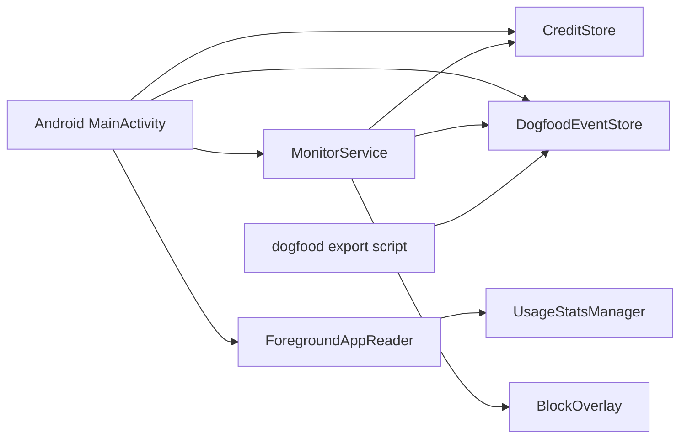
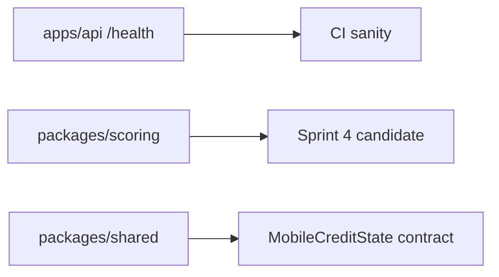

# Repository Audit And Cleanup

문서 상태: v0.1  
작성일: 2026-05-03  
역할: 저장소에서 무엇을 남기고, 무엇을 제거하고, 무엇을 다음에 정리할지 판단하는 기준 문서

현재 정리 실행 순서는 [mvp-execution-plan.md](mvp-execution-plan.md)를 우선한다. 이 문서는 cleanup 판단 reference로 유지한다.

## 1. Current Diagnosis

현재 저장소의 핵심 산출물은 Android local blocker prototype이다. 실제 실행 가치가 있는 코드는 `apps/android`, local dogfood scripts, mobile credit contract다.

유지할 것:

- `apps/android`: 현재 유일한 runnable product surface.
- `scripts/android-dogfood-*`: 실기기 반복 검증에 필요.
- `packages/shared`: Sprint 4 API shape와 모바일 contract의 기준.
- `packages/scoring`: Sprint 4에서 재사용할 rules-first scoring scaffold. 단, 현재 API에는 연결하지 않는다.
- `apps/ios`: Xcode 전환 전 소스/target 설계 skeleton.
- `apps/api`: 지금은 `/health`만 제공하는 scaffold.

제거할 것:

- build artifacts: `.gradle/`, `apps/android/build/`, `dist/`, `artifacts/`.
- 이중 저장되는 Android debug log.
- 실제 enrichment 없이 score decision을 반환하는 GitHub webhook placeholder.
- 인터뷰/설문/fake-door 중심의 오래된 Phase 0 문서.

## 2. Cleanup Decisions

| 항목 | 결정 | 이유 |
| --- | --- | --- |
| Android debug log | 삭제 | dogfood event log와 중복되어 UI, TSV, summary가 어긋날 수 있다. |
| DogfoodEventStore | 유지/확장 | in-app recent log, 14일 summary, TSV export의 단일 source of truth다. |
| GitHub webhook placeholder | 삭제 | PR files/reviews/checks 없이 scoring하면 제품 신뢰를 깎는다. |
| Scoring package | 유지 | Sprint 4에서 rules-first scoring을 다시 연결할 수 있다. |
| API GitHub env placeholders | 삭제 | 현재 실행되지 않는 설정은 onboarding을 흐린다. |
| Phase 0 interview/survey docs | 삭제 | 사용자가 인터뷰/설문 없이 만들기로 결정했고, 실행 문서와 충돌한다. |

## 3. Current Architecture

API/scoring은 아직 runtime path가 아니다.

## 4. Product/Market Implications

경쟁 서비스 재확인 결과, 단순 blocker는 과금 방어력이 약하다.

- Opal은 무료 플랜과 고가 Pro/lifetime 플랜을 운영한다.
- Freedom은 cross-device blocker와 locked mode를 전면에 둔다.
- ScreenZen은 무료 기대치를 만든다.
- WakaTime은 개발 활동 stats와 commit/PR stats에 과금한다.
- Beeminder는 GitHub commits/issues를 돈이 걸린 pledge와 연결한다.

따라서 추천 포지션은 계속 동일하다.

> Developer proof ledger first, selected-app blocking second.

즉, 앱 차단만 만들지 말고 `검증 가능한 개발 활동 -> 설명 가능한 credit ledger -> 선택 앱 정책`을 만든다.

## 5. Refactor Backlog

다음 정리 순서:

1. `DogfoodEventStore`에 event type 상수 또는 sealed class를 도입할지 검토한다.
2. `packages/shared`의 `MobileCreditState`를 Android/iOS 문서와 자동 비교하는 작은 contract test를 추가한다.
3. iOS skeleton은 Xcode project 생성 전까지 문서 수준으로만 유지한다.
4. [product-security-hardening-plan.md](product-security-hardening-plan.md)의 immediate queue에 따라 Android target guardrail을 먼저 구현한다.
5. [github-sprint4-entry.md](github-sprint4-entry.md)의 PR A 기준으로 `apps/api`에 webhook HMAC/dedupe foundation을 추가한다. scoring route는 enrichment와 ledger가 함께 준비될 때만 복구한다.

완료된 정리:

- local TSV analyzer 추가.
- `DogfoodEventStore` export/parse/sanitize/retention/dedupe unit test 추가.
- TypeScript/Android policy golden fixture 추가.
- Android privacy/permission disclosure UI 추가.
- Android dogfood review/Data Quality/Gate UI 추가.
- Android MainActivity section helper 분리.
- GitHub Sprint 4 entry spec 추가.
- Control/account design spec 추가.
- Product/security hardening plan 추가.

## 6. Do Not Build Yet

- GitHub webhook/scoring runtime.
- Full-diff LLM scoring.
- 결제, money stake, 벌금.
- 부모/학교/미성년자/MDM.
- 앱 삭제 방지, Device Admin, AccessibilityService.
- Leaderboard.

## 7. Sources Checked

- Opal pricing: https://opalapp.com/pricing
- Freedom pricing: https://freedom.to/premium
- ScreenZen: https://screenzen.co/
- WakaTime pricing: https://wakatime.com/pricing
- Beeminder GitHub integration: https://www.beeminder.com/gitminder/
- Apple FamilyControls: https://developer.apple.com/documentation/familycontrols
- Android UsageStatsManager: https://developer.android.com/reference/android/app/usage/UsageStatsManager
- Google Play AccessibilityService policy: https://support.google.com/googleplay/android-developer/answer/10964491
- GitHub Octoverse 2025: https://github.blog/news-insights/octoverse/octoverse-a-new-developer-joins-github-every-second-as-ai-leads-typescript-to-1/
